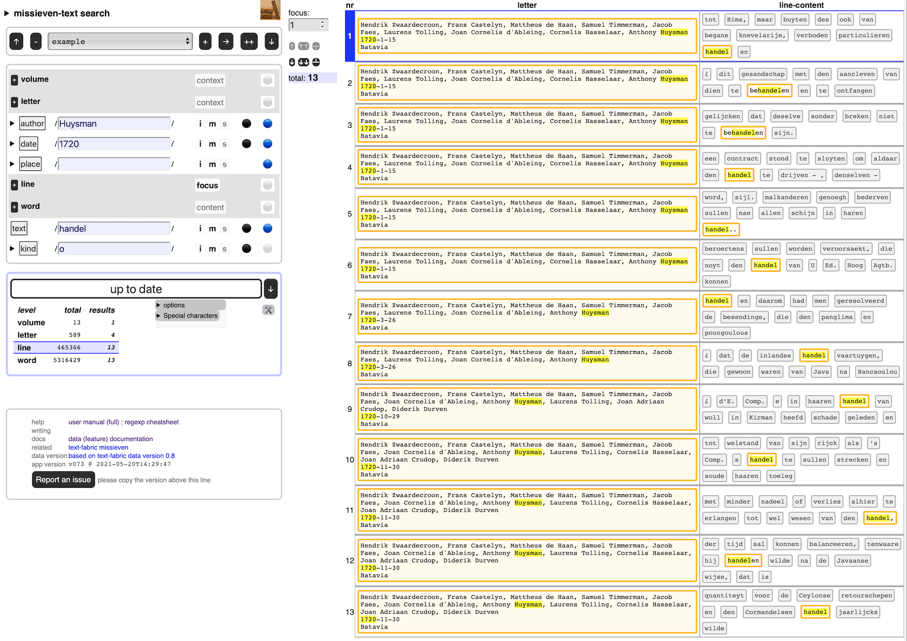

# General Missives

The General Missives are a text corpus that can be analysed with Text-Fabric.
See [clariah/wp6-missieven](https://github.com/clariah/wp6-missieven) for more information.

This repository contains a generated multi-layer full-text search interface for this corpus.

Just click
[missieven-search](https://CLARIAH.github.io/wp6-missieven-search/)
and off you go.

You can do full text search via regular expressions, not only in the full-text,
but also in some attributes of the text.

An example search is in [example.json](example.json).
Download the file, then import it in your search interface, and you see it happening.

The interface works completely inside your browser without consulting any server,
apart from first traveling from GitHub to your browser.

If you want to search completely off-line, you can press a button to
download the complete package as a zipfile from within the app.

You can import and export search jobs as json files.
You can export search results as tab-separated files.

More info about layered search is in the
[manual](https://annotation.github.io/text-fabric/tf/about/clientmanual.html).

# Author

[Dirk Roorda](https://github.com/dirkroorda)

